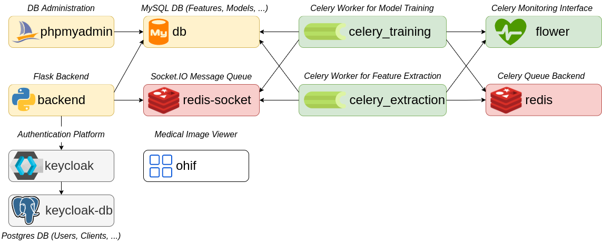

# QuantImage v2 - Backend

## Context

This repository is part of the QuantImage v2 platform, which includes the following repositories:

- https://github.com/medgift/quantimage2-setup - Setup script for the platform
- https://github.com/medgift/quantimage2-frontend - Frontend in React
- https://github.com/medgift/quantimage2_backend - Backend in Python
- https://github.com/medgift/quantimage2-kheops - Custom configuration for the [Kheops](https://kheops.online) platform

## Project Structure

### Docker

The project uses Docker for easy build & deployment, using the following files :

- `webapp/Dockerfile` : Installs the Python backend dependencies and starts the Flask server
- `workers/Dockerfile` : Installs the Celery worker dependencies and starts the worker
- `flower/Dockerfile` : Installs & starts the Flower monitoring interface for the Celery workers
- `docker-compose.yml` : Base Docker Compose file
- `docker-compose.override.yml` : Override file for local development, exposing ports & mapping source directories to containers.
- `docker-compose.local.yml` : Exports ports but does not map the source code directly
- `docker-compose.vm.yml` : File for the [QuantImage v2 VM](https://medgift.github.io/quantimage-v2-info/#getting-started), restarting containers automatically on reboot or crash
- `docker-compose.zrad.yml` : File to include the [ZRad](https://medical-physics-usz.github.io) feature extraction library (currently not publicly available)
- `docker-compose.prod.yml` : Production file for use with Traefik

Below is an overview of the various containers that constitute the backend:



### Local development
The .env file defines the QUANTIMAGE2_DATA_MOUNT_DIRECTORY environment variable to specify which directory will be used
to mount the different docker volumes. This is not part of git - please set the mounting directory at setup and create a `.env` file at the root of this repo when setting up the repo for the first time.

The content of the file could be the following:

```
# Docker volumes mount directory
QUANTIMAGE2_DATA_MOUNT_DIRECTORY=/Users/thomasvetterli/quantimage2-data
```

*Note:* On macOS you cannot mount on / as it's not writeable on the newest versions of macOS.

### Code Structure

See the [Documentation](https://quantimage-v2-backend.readthedocs.io/en/latest/) for more information on the code structure.

