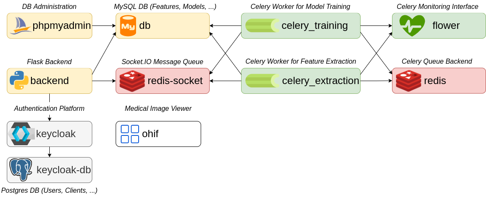

# QuantImage v2 - Backend

## Changelog

### 3.2

- **Upgraded to Python 3.12** — Updated base Docker images, dependencies, and fixed compatibility issues with SQLAlchemy 2.0, Pandas 2.x, and Python 3.12 runtime changes.
- **Added unit tests** — Introduced a `tests/` suite covering shared utilities, ORM models, ML pipeline, REST API routes, Celery worker functions, and feature storage.

### 3.1

- Previous stable release (Python 3.8).

## Context

This repository is part of the QuantImage v2 platform, which includes the following repositories:

- https://github.com/medgift/quantimage2-setup - Setup script for the platform
- https://github.com/medgift/quantimage2-frontend - Frontend in React
- https://github.com/medgift/quantimage2_backend - Backend in Python
- https://github.com/medgift/quantimage2-kheops - Custom configuration for the [Kheops](https://kheops.online) platform

## Deployment on ehealth server at HEVS
When deploying this project on the ehealth server one needs to ensure that another instance of keycloak has not been started by another project. This repo is supposed
to only start keycloak if another one is already running. If this process does not work and you end up with two instances of keycloak running we end up with authentification problems.

After starting quantimage - please check:

 `docker ps | grep keycloak`. If you find two - then grab the id of the container named quantimagev2-keycloak and finally remove the running keycloak container and associated postgres database container by doing `docker rm -f <id_container>`. Possibly `docker compose rm <docker_compose_service_name> is working as well.

## Project Structure

### Docker

The project uses Docker for easy build & deployment, using the following files :

- `webapp/Dockerfile` : Installs the Python backend dependencies and starts the Flask server
- `workers/Dockerfile` : Installs the Celery worker dependencies and starts the worker
- `flower/Dockerfile` : Installs & starts the Flower monitoring interface for the Celery workers
- `docker-compose.yml` : Base Docker Compose file
- `docker-compose.override.yml` : Override file for local development, exposing ports & mapping source directories to containers.
- `docker-compose.local.yml` : Exports ports but does not map the source code directly
- `docker-compose.vm.yml` : File for the [QuantImage v2 VM](https://medgift.github.io/quantimage-v2-info/#getting-started), restarting containers automatically on reboot or crash
- `docker-compose.prod.yml` : Production file for use with Traefik

Below is an overview of the various containers that constitute the backend:



### Local development
The .env file defines the QUANTIMAGE2_DATA_MOUNT_DIRECTORY environment variable to specify which directory will be used
to mount the different docker volumes. This is not part of git - please set the mounting directory at setup and create a `.env` file at the root of this repo when setting up the repo for the first time.

The content of the file could be the following:

```
# Docker volumes mount directory
QUANTIMAGE2_DATA_MOUNT_DIRECTORY=/Users/thomasvetterli/quantimage2-data
```

*Note:* On macOS you cannot mount on / as it's not writeable on the newest versions of macOS.

To run the python code locally without being in the web app use the following steps:
- install homebrew and pyenv to install python version
- install python 3.8 `pyenv install 3.8.15` (it's what is used in the webapp dockerfile and workers dockerfile)
- install [`uv`](https://github.com/astral-sh/uv) to manage python virtual environments plus install requirements
- create a virutal environment in the sub folder that you want to work on: `uv venv` (you may need one for the webapp and one for the worker)
- install dependencies with `uv pip install -r requirements.txt`
- for jupyter notebook development - run (after having activated the environment with `ßource .venv/bin/activate`) - `python -m ipykernel install --user --name webapp --display-name "Webapp python environment"`
- in the notebook subfolder we provide example scrips on how to interact with the db via pandas or a local flask context.

### Database migrations

Schema changes are managed with [Alembic](https://alembic.sqlalchemy.org/). **Important:** the
migration files under `webapp/alembic/versions/` are **git-ignored**, and the dev container only
**applies** migrations on startup — it no longer auto-generates them.

What this means in practice:

- **On container start (dev/local only):** when `DB_AUTOMIGRATE=1` (set in `env_files/debug.env`
  / `docker-compose.local.yml`), the entrypoint runs `alembic upgrade head` to apply any pending
  migrations. It does **not** create migrations — that previously produced an empty revision file
  on every boot.
- **When you change a model** (`shared/quantimage2_backend_common/models.py`) you must generate the
  migration yourself and apply it:
  ```bash
  docker compose exec backend alembic revision --autogenerate -m "describe change"
  # review the generated file. Autogenerate only emits schema DDL (CREATE TABLE / ADD COLUMN);
  # if existing rows need values for a new NOT NULL column, add the data backfill SQL by hand.
  docker compose exec backend alembic upgrade head
  ```
- **Migrations do not reach other machines or prod via git** (they are ignored). A migration that
  must be shared — especially one with a hand-written data backfill — has to be **force-added**
  (`git add -f webapp/alembic/versions/<file>.py`) or applied to the target database manually.
- **Production** does not set `DB_AUTOMIGRATE`, so it never runs Alembic automatically. After a
  deploy that includes a schema change, apply it manually (take a DB backup first):
  ```bash
  docker compose -f docker-compose.yml -f docker-compose.prod.yml exec backend alembic upgrade head
  ```
  This requires the migration file to be present on the prod server (see the git-ignore note above).

### Radiomics feature prefixes (legacy ZRAD / Riesz)

Radiomics feature IDs are `{modality}‑{roi}‑{feature_name}` (the separator is U+2011, a
non-breaking hyphen) and the `{feature_name}` must start with a known prefix listed in
`shared/quantimage2_backend_common/const.py` (`prefixes`, used by `featureIDMatcher`).

`ZRAD_FEATURE_PREFIXES = ["zrad"]` and `RIESZ_FEATURE_PREFIXES = ["tex"]` are kept **for
parsing only**. We no longer compute ZRAD or Riesz features (the ZRAD build/extraction
support was removed), but these prefixes must stay so that feature IDs already stored in the
database continue to parse. Removing a prefix makes `featureIDMatcher` silently drop or
misclassify existing rows with that prefix — do not remove them without first confirming no
such features exist in the database and updating the frontend + a data migration accordingly.

### Code Structure

See the [Documentation](https://quantimage-v2-backend.readthedocs.io/en/latest/) for more information on the code structure.

