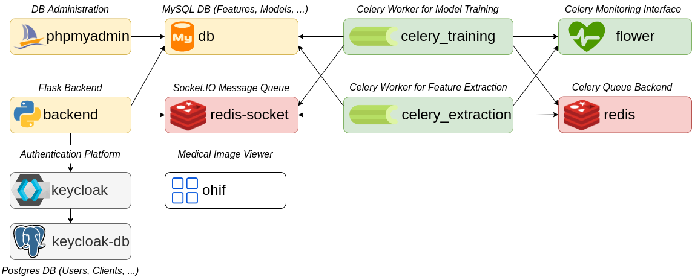

# QuantImage v2 - Backend

## Changelog

### 3.4

- **Univariate feature screening with FDR control** — New endpoint `POST /fdr/simpleFDR` (`routes/FDR.py`, `service/FDR.py`) screens the selected radiomics + clinical features of a collection one by one against the outcome and applies Benjamini–Hochberg multiple-testing correction (`statsmodels`). The test is chosen from the feature's measurement scale and the outcome type: Mann-Whitney U / Kruskal-Wallis (continuous, classification), chi-square or Fisher exact (categorical, classification), Wald test on a univariate Cox model (continuous, survival) and k-sample log-rank (categorical, survival). The response lists, for each requested q-value, the surviving features with raw and adjusted p-values, the test used and its statistic. Features that cannot be tested (constant, too few observations/events, non-converging Cox fit) are skipped instead of voiding the whole correction. Clinical definitions are resolved through the same code path as model training (`resolve_clinical_definitions`), so screening and training never disagree on which clinical columns exist. Covered by `tests/test_fdr.py`. New backend deps: `statsmodels`, `scipy`.
- **Okapy / PyRadiomics extraction stack** — Workers now build against the Okapy `refactor/major-restructure` branch (new `load_config` / `build_extraction_pipeline` API, per-task extraction workspace). PyRadiomics is pinned to the `v3.1.0` tag and numpy is held at 1.x through `workers/requirements-constraints.txt` (`master` needs numpy 2 and returned complex-valued features, causing `Data truncated for column 'value'` on insert). Extraction workspaces live on the shared data volume (`QUANTIMAGE_WORK_DIR=/quantimage2-data/tmp/extraction`) instead of the container's writable layer.
- **Extraction cancellation fixes** — Cancelling an extraction now revokes the queued tasks too (task IDs are recorded when the chord is dispatched, revoked in one broadcast) and the unused chord group result is dropped. Worker tasks clean up the downloaded study in a `finally` block, a revoke raises `SoftTimeLimitExceeded` so cleanup still runs, and a cancellation is no longer reported as a failed extraction (a real soft time limit still is). Study downloads are streamed to disk in chunks instead of read into memory.
- **Robustness fixes**:
  - `get_or_create()` no longer takes the `FOR UPDATE` row lock when the row already exists, which serialised every feature-page load of an album on one lock and caused `1205` lock-wait timeouts.
  - Kheops and Flower HTTP calls have connect/read timeouts (`KHEOPS_HTTP_TIMEOUT`), so a hung PACS connection releases its request or worker slot.
  - Failed feature-task status is JSON-serialisable (raw exception objects are stringified) and reports the correct exception type for multi-line messages.
  - Clinical-data uploads are filtered to the album's patients and a file with no matching patient returns a JSON 400 instead of an HTML error page; training and dedup skip value-less orphan definitions that used to crash `set_index("PatientID")`.
- **Default presets** — `mask_preprocessing` removed from all default presets and the PET/CT volume resampler order lowered from 3 to 1.
- **Docker / env** — Dev `keycloak` and `keycloak-db` restart automatically; the solo-pool debug command in `docker-compose.override.yml` is commented out by default (it cannot terminate a running task, so cancellation behaves differently than with the production prefork pool); dead `CELERY_WORKER_CONCURRENCY` interpolation removed from `workers.env` (per-worker values live in `workers-extraction.env` / `workers-training.env`). Image tags bumped to 3.4. No database migration is required for this release.

### 3.3

- **Multi-file clinical features** — Clinical feature definitions are now scoped to an uploaded CSV file (new `ClinicalFeatureFile` model + `clinical_feature_file_id` foreign key on definitions), so several clinical-data files can coexist per album. New REST endpoints: `GET/POST /clinical-features-files` and `PATCH/DELETE /clinical-features-files/<id>` to list, upload, rename and delete files.
- **Clinical features correctness & security fixes**:
  - Re-uploading a clinical-data file now **replaces** its values per file instead of appending, so duplicate `(patient, definition)` value rows are no longer created.
  - Legacy `FeatureCollection`s referencing clinical feature IDs resolve to a single definition (lowest file id / "Legacy" file), so old collections don't pull the same feature from multiple files.
  - `PATCH /clinical-features-definitions` enforces ownership (prevents IDOR via client-supplied ids) and returns 400/404 on malformed bodies instead of 500.
  - `/clinical-features/unique-values` skips columns with no matching definition instead of failing with a 500.
  - Added regression tests (`tests/test_clinical_features_routes.py`), including an `ON DELETE CASCADE` test.
- **Dropped MATLAB/ZRAD build** — Removed the dead MATLAB/MCR environment and ZRAD build steps from `workers/Dockerfile` and deleted `docker-compose.zrad.yml`. The `zrad`/`tex` feature-ID prefixes are kept for **parsing only** (see [Radiomics feature prefixes](#radiomics-feature-prefixes-legacy-zrad--riesz)).
- **Docker Compose improvements** — Services restart automatically (`restart: unless-stopped`) and `depends_on` uses the MySQL healthcheck so backend/workers wait for the database to be ready.
- **Migration workflow change** — On startup the dev/local entrypoint only **applies** migrations (`alembic upgrade head`); it no longer auto-generates them (see [Database migrations](#database-migrations)). ⚠️ Upgrading to 3.3 requires applying the `clinical_feature_file` migration to existing databases — migration files are git-ignored, so it must be present on (or recreated on) the target machine. On the HEVS production server this was done with the hand-written backfill in [`docs/fix_clinical_feature_file_id_backfill.sql`](docs/fix_clinical_feature_file_id_backfill.sql) (creates one `clinical_feature_file` per existing `(user_id, album_id)` group, links existing definitions, then enforces the `NOT NULL` FK). Apply the same script to any other database still on the pre-3.3 schema.

### 3.2

- **Upgraded to Python 3.12** — Updated base Docker images, dependencies, and fixed compatibility issues with SQLAlchemy 2.0, Pandas 2.x, and Python 3.12 runtime changes.
- **Added unit tests** — Introduced a `tests/` suite covering shared utilities, ORM models, ML pipeline, REST API routes, Celery worker functions, and feature storage.

### 3.1

- Previous stable release (Python 3.8).

## Context

This repository is part of the QuantImage v2 platform, which includes the following repositories:

- https://github.com/medgift/quantimage2-setup - Setup script for the platform
- https://github.com/medgift/quantimage2-frontend - Frontend in React
- https://github.com/medgift/quantimage2_backend - Backend in Python
- https://github.com/medgift/quantimage2-kheops - Custom configuration for the [Kheops](https://kheops.online) platform

## Deployment on ehealth server at HEVS
When deploying this project on the ehealth server one needs to ensure that another instance of keycloak has not been started by another project. This repo is supposed
to only start keycloak if another one is already running. If this process does not work and you end up with two instances of keycloak running we end up with authentification problems.

After starting quantimage - please check:

 `docker ps | grep keycloak`. If you find two - then grab the id of the container named quantimagev2-keycloak and finally remove the running keycloak container and associated postgres database container by doing `docker rm -f <id_container>`. Possibly `docker compose rm <docker_compose_service_name> is working as well.

## Project Structure

### Docker

The project uses Docker for easy build & deployment, using the following files :

- `webapp/Dockerfile` : Installs the Python backend dependencies and starts the Flask server
- `workers/Dockerfile` : Installs the Celery worker dependencies and starts the worker
- `flower/Dockerfile` : Installs & starts the Flower monitoring interface for the Celery workers
- `docker-compose.yml` : Base Docker Compose file
- `docker-compose.override.yml` : Override file for local development, exposing ports & mapping source directories to containers.
- `docker-compose.local.yml` : Exports ports but does not map the source code directly
- `docker-compose.vm.yml` : File for the [QuantImage v2 VM](https://medgift.github.io/quantimage-v2-info/#getting-started), restarting containers automatically on reboot or crash
- `docker-compose.prod.yml` : Production file for use with Traefik

Below is an overview of the various containers that constitute the backend:



### Local development
The .env file defines the QUANTIMAGE2_DATA_MOUNT_DIRECTORY environment variable to specify which directory will be used
to mount the different docker volumes. This is not part of git - please set the mounting directory at setup and create a `.env` file at the root of this repo when setting up the repo for the first time.

The content of the file could be the following:

```
# Docker volumes mount directory
QUANTIMAGE2_DATA_MOUNT_DIRECTORY=/Users/thomasvetterli/quantimage2-data
```

*Note:* On macOS you cannot mount on / as it's not writeable on the newest versions of macOS.

To run the python code locally without being in the web app use the following steps:
- install homebrew and pyenv to install python version
- install python 3.8 `pyenv install 3.8.15` (it's what is used in the webapp dockerfile and workers dockerfile)
- install [`uv`](https://github.com/astral-sh/uv) to manage python virtual environments plus install requirements
- create a virutal environment in the sub folder that you want to work on: `uv venv` (you may need one for the webapp and one for the worker)
- install dependencies with `uv pip install -r requirements.txt`
- for jupyter notebook development - run (after having activated the environment with `ßource .venv/bin/activate`) - `python -m ipykernel install --user --name webapp --display-name "Webapp python environment"`
- in the notebook subfolder we provide example scrips on how to interact with the db via pandas or a local flask context.

### Database migrations

Schema changes are managed with [Alembic](https://alembic.sqlalchemy.org/). **Important:** the
migration files under `webapp/alembic/versions/` are **git-ignored**, and the dev container only
**applies** migrations on startup — it no longer auto-generates them.

What this means in practice:

- **On container start (dev/local only):** when `DB_AUTOMIGRATE=1` (set in `env_files/debug.env`
  / `docker-compose.local.yml`), the entrypoint runs `alembic upgrade head` to apply any pending
  migrations. It does **not** create migrations — that previously produced an empty revision file
  on every boot.
- **When you change a model** (`shared/quantimage2_backend_common/models.py`) you must generate the
  migration yourself and apply it:
  ```bash
  docker compose exec backend alembic revision --autogenerate -m "describe change"
  # review the generated file. Autogenerate only emits schema DDL (CREATE TABLE / ADD COLUMN);
  # if existing rows need values for a new NOT NULL column, add the data backfill SQL by hand.
  docker compose exec backend alembic upgrade head
  ```
- **Migrations do not reach other machines or prod via git** (they are ignored). A migration that
  must be shared — especially one with a hand-written data backfill — has to be **force-added**
  (`git add -f webapp/alembic/versions/<file>.py`) or applied to the target database manually.
- **Production** does not set `DB_AUTOMIGRATE`, so it never runs Alembic automatically. After a
  deploy that includes a schema change, apply it manually (take a DB backup first):
  ```bash
  docker compose -f docker-compose.yml -f docker-compose.prod.yml exec backend alembic upgrade head
  ```
  This requires the migration file to be present on the prod server (see the git-ignore note above).
- **Worked example (3.3 `clinical_feature_file`):** because the migration file never reached the
  HEVS prod server, the new code ran against the old schema and every `ClinicalFeatureDefinition`
  query failed with `Unknown column 'clinical_feature_definition.clinical_feature_file_id'`. The new
  `clinical_feature_file` table had been auto-created (SQLAlchemy creates missing tables but never
  alters existing ones), but the `NOT NULL` FK column was never added to the pre-existing
  `clinical_feature_definition` table. The fix — applied directly as SQL since no migration file was
  available — is checked in at
  [`docs/fix_clinical_feature_file_id_backfill.sql`](docs/fix_clinical_feature_file_id_backfill.sql):
  add the column nullable, create one `clinical_feature_file` per existing `(user_id, album_id)`
  group, backfill the FK on every definition, then switch the column to `NOT NULL` + add the FK.
  Take a DB backup first (`mysqldump`), then run it as root:
  ```bash
  docker compose exec -T db mysqldump -u root -p quantimage2 > backup_before_cff_fix.sql
  docker compose exec -T db mysql -u root -p quantimage2 < docs/fix_clinical_feature_file_id_backfill.sql
  ```

### Radiomics feature prefixes (legacy ZRAD / Riesz)

Radiomics feature IDs are `{modality}‑{roi}‑{feature_name}` (the separator is U+2011, a
non-breaking hyphen) and the `{feature_name}` must start with a known prefix listed in
`shared/quantimage2_backend_common/const.py` (`prefixes`, used by `featureIDMatcher`).

`ZRAD_FEATURE_PREFIXES = ["zrad"]` and `RIESZ_FEATURE_PREFIXES = ["tex"]` are kept **for
parsing only**. We no longer compute ZRAD or Riesz features (the ZRAD build/extraction
support was removed), but these prefixes must stay so that feature IDs already stored in the
database continue to parse. Removing a prefix makes `featureIDMatcher` silently drop or
misclassify existing rows with that prefix — do not remove them without first confirming no
such features exist in the database and updating the frontend + a data migration accordingly.

### Code Structure

See the [Documentation](https://quantimage-v2-backend.readthedocs.io/en/latest/) for more information on the code structure.

